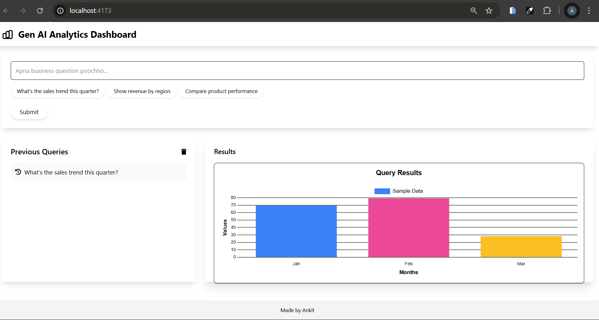

# Data Query Dashboard 📊

Hey there! I’m so excited to share my **Gen AI Analytics Dashboard** with you! I built this project for the **Internshala Frontend Engineering Intern Challenge**, and I’ve poured my heart into making it something you’ll love. This dashboard lets you ask business questions in simple English, keeps track of your past queries, and shows the results in a neat bar chart. It’s user-friendly, looks great on any device, and has some fun animations to make the experience even better. Let’s dive in! 😊

## Live Demo
[Live URL](https://data-query-dashboard-beta.vercel.app/ ) 
 
(I’ll update this link once I deploy the project on Vercel – stay tuned!)

## What This Dashboard Does
This project is all about making data analytics easy and fun! Here’s what you can do with it:
- **Ask Questions in Plain English**: Just type questions like "What’s the sales trend this quarter?" or "Show revenue by region" – as if you’re chatting with a friend.
- **Keep Track of Your Queries**: It saves all your past questions in a history section, so you can look back anytime (and clear them if you want).
- **See Results in a Bar Chart**: The app shows your query results in a clean and colorful bar chart that’s easy to understand.
- **Fun Animations**: I’ve added some smooth animations to make everything feel lively – like when the chart loads or when you clear your history.
- **Works on Any Device**: Whether you’re on your phone or laptop, the dashboard looks awesome and works perfectly.
- **Friendly Error Messages**: If something goes wrong, you’ll get a simple message to help you out – no confusing tech stuff!

 ## Screenshots
### Dashboard Overview


(I’ll add the screenshot after deployment – it’ll give you a peek at how the app looks!)

## Tools I Used to Build This
Here’s the tech stack I used to bring this project to life:
- **React.js**: For building the UI and managing all the components.
- **Vite**: To make development super fast and smooth (I love how quick it is!).
- **Redux Toolkit**: To manage the app’s state, like storing queries and results.
- **Tailwind CSS**: For styling the app with a clean and modern design.
- **Framer Motion**: To add those cool animations that make the app feel alive.
- **Chart.js & react-chartjs-2**: For creating the bar chart to show query results.
- **React Icons**: For adding icons to make the UI more intuitive.

## How to Try It Out
Want to see the dashboard in action on your own machine? It’s really easy to set up! Just follow these steps:

1. **Clone the Repository**:
   ```bash
   git clone https://github.com/ankit2005-star/data-query-dashboard.git
   cd data-query-dashboard

2.**Install Dependencies**:
   npm install

3.**Start the Development Server:**:
   npm run dev
Open in Browser: Go to http://localhost:5173 to check out the app!
 
My Journey of Building This Project
Let me tell you a bit about how I made this dashboard:

Getting Started: I chose Vite to set up the project because it’s super fast and works great with React. It made my life so much easier!
Managing Data: I used Redux Toolkit to handle the app’s state – like keeping track of user queries, history, and results. I also used createAsyncThunk to simulate AI responses for the queries.
Designing the Look: I went with Tailwind CSS to style the app. It helped me create a clean and responsive design without spending too much time on custom CSS.
Adding the Chart: I used Chart.js with react-chartjs-2 to show query results in a bar chart. I made sure the chart is colorful and animates nicely when it loads.
Making It Smooth: I added animations using Framer Motion – like a spinning loader, fading cards, and smooth transitions when you interact with the app.
Testing on Different Devices: I tested the app on my phone and laptop to make sure it looks great and works well everywhere.
Challenges I Ran Into
Building this project wasn’t always easy – here are some bumps I hit along the way and how I got past them:

Setting Up Tailwind CSS: I had some trouble with Tailwind CSS v4 at first, but I figured it out by installing @tailwindcss/postcss and setting up tailwind.config.js.
Getting the Chart to Work: The bar chart wasn’t showing up properly at first. I realized I needed to register all Chart.js components (CategoryScale, LinearScale, etc.), and that fixed it!
Handling Async Data: Managing asynchronous query processing was a bit tricky, but I used Redux Toolkit’s createAsyncThunk to simulate AI responses, and it worked out well.
Line Endings on Windows: I got some warnings about CRLF/LF line endings since I’m on Windows. I added a .gitattributes file to make sure line endings are consistent across platforms.
Why I Think This Project Is Special
I really tried to make this project stand out, and here’s why I think it’s worth checking out:

Easy to Use: I designed the app to be super simple – anyone can use it without getting confused.
Smooth and Fun: The animations make the app feel polished and enjoyable to use.
Looks Great Everywhere: I made sure the app works perfectly on both mobile and desktop screens.
Little Details Matter: I added things like a loading spinner, error messages, and hover effects to make the app feel complete.
Clean Code: I kept the code organized and used Redux Toolkit for state management, so it’s easy to understand and maintain.
Ideas for the Future
If I get a chance to work on this project more, here are some things I’d love to add:

More chart types (like line or pie charts) to show data in different ways.
A real AI API to process natural language queries for even better results.
User login so people can save their query history.
Maybe some fun customization options for the UI!
A Bit About Me
Hi, I’m ANKIT GODBOLE ! I’m a frontend developer who loves creating web apps that are both useful and beautiful. Working on this project was such a fun experience, and I learned so much about React, state management, and UI design. I’m really excited about the chance to join Internshala as a Frontend Engineering Intern and work on awesome projects! 😄

Thanks for taking the time to check out my project! I hope you like it as much as I loved building it. 🚀